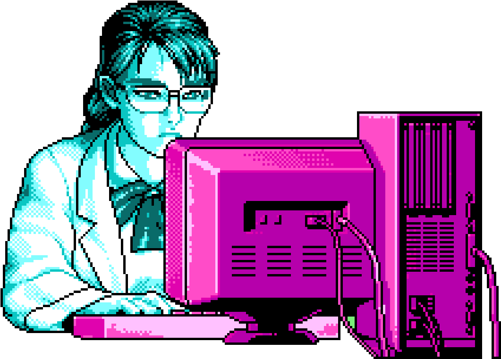

# Welcome to the repo of Kuro

  

  
  

Here you will find everything that I learned in C++  
Visit me at me profile [here](https://github.com/UP210630)

[♫](https://www.youtube.com/watch?v=k_TbOH8iE4U)

##Main Structure

<o>
    <li><a href="https://github.com/UP210630/UP210630_CPP/tree/main/Programation/U1 Programming Introduccion">  U1 Programming Introduccion</a></li>
    <li><a href="https://github.com/UP210630/UP210630_CPP/tree/main/Programation/U2 Control Structures and Cycles">  U2 Control Structures and Cycles</a></li>
    <li><a href="https://github.com/UP210630/UP210630_CPP/tree/main/Programation/U3 Functions">  U3 Functions</a></li>
    <li><a href="https://github.com/UP210630/UP210630_CPP/tree/main/Programation/U4 Files and Arrays">  U4 Files and Arrays</a></li>

